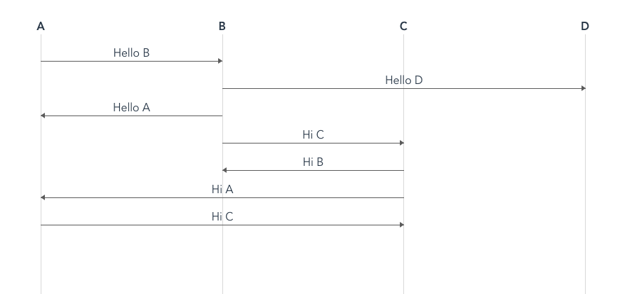

# timing-diagram
## 说明
timing-diagram是一个VUE时序图组件，用HTML+CSS+js元素来实现视图， 因此可根据UI要求自定义样式，组件捕捉了点击事件，详情可查看使用示例。

## 通过NPM安装
```
npm i @dzc314/timing-diagram -S
```

### 引入组件
```
import '@dzc314/timing-diagram'
```

### 预览


### 使用
```
<template>
  <div id="app">
    <div class="timing-view">
      <timing-diagram
        :events="events"
        :columns="columns"
        @eventClick="eventHandler"
      ></timing-diagram>
    </div>
  </div>
</template>

<script>
export default {
  data() {
    return {
      columns: ['A', 'B', 'C', 'D'], // columns定义的列名须与evens数组单个对象中的from/to匹配
      events: [
        {
          from: 'A', // 必须在columns数组中先定义
          to: 'B', // 必须在columns数组中先定义
          text: 'Hello B', // 时序图中的事件内容
        },
        {
          from: 'B',
          to: 'D',
          text: 'Hello D',
        },
        {
          from: 'B',
          to: 'A',
          text: 'Hello A',
        },
        {
          from: 'B',
          to: 'C',
          text: 'Hi C',
        },
        {
          from: 'C',
          to: 'B',
          text: 'Hi B',
        },
        {
          from: 'C',
          to: 'A',
          text: 'Hi A',
        },
        {
          from: 'A',
          to: 'C',
          text: 'Hi C',
        },
      ],
    }
  },
  methods: {
    eventHandler(event) {
      console.log(event)
    },
  },
}
</script>
```


### Customize configuration
See [Configuration Reference](https://cli.vuejs.org/config/).
